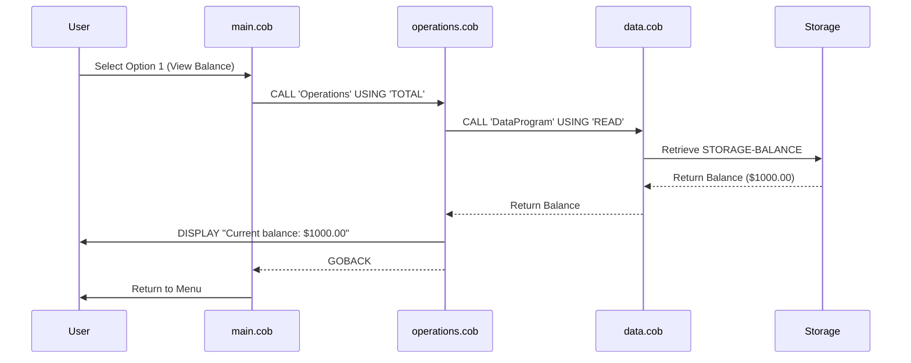
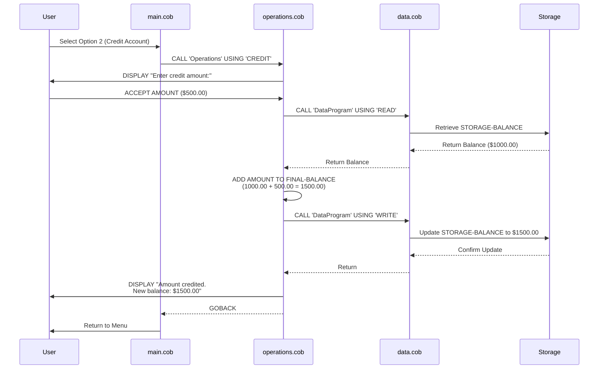
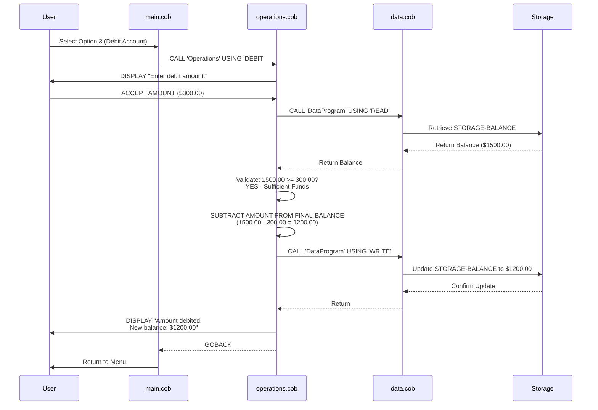
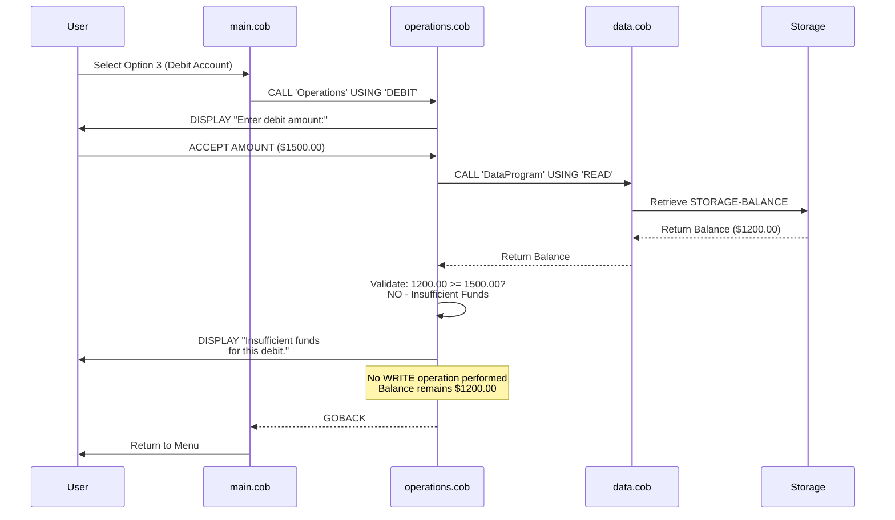
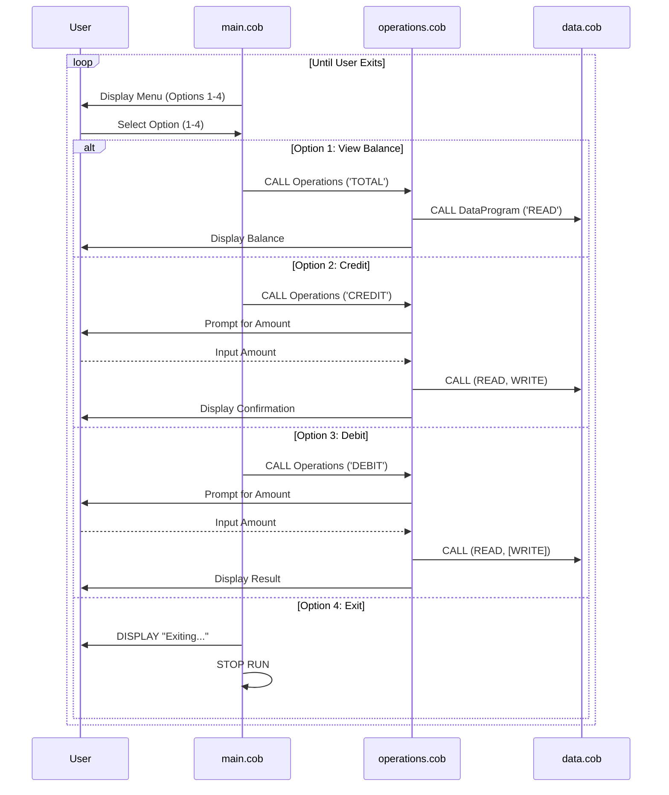

# School Accounting System - COBOL Documentation

## Overview
This COBOL-based accounting system manages student account operations, including balance inquiries, credit transactions, and debit transactions with fund validation.

## System Architecture

The system is built around three core COBOL programs that work together to handle account management:

---

## COBOL Programs

### 1. **main.cob** - Account Management Interface
**Purpose:** Entry point and user interface for the accounting system

**Key Functions:**
- Displays a menu-driven interface for account operations
- Accepts user input to select operations (1-4)
- Routes user selections to appropriate operations
- Implements a continuous loop until user chooses to exit

**Menu Options:**
- **Option 1:** View Balance (calls TOTAL operation)
- **Option 2:** Credit Account (calls CREDIT operation)
- **Option 3:** Debit Account (calls DEBIT operation)
- **Option 4:** Exit Program

**Key Variables:**
- `USER-CHOICE`: Numeric input for menu selection (0-4)
- `CONTINUE-FLAG`: Controls program loop (YES/NO)

---

### 2. **operations.cob** - Transaction Processing
**Purpose:** Handles all account transaction logic and orchestrates data operations

**Key Functions:**
- **TOTAL Operation:** Retrieves and displays current account balance
- **CREDIT Operation:** 
  - Prompts for credit amount
  - Retrieves current balance
  - Adds amount to balance
  - Persists updated balance
  - Displays confirmation with new balance
- **DEBIT Operation:**
  - Prompts for debit amount
  - Validates sufficient funds before transaction
  - Performs debit if funds available
  - Persists updated balance
  - Displays appropriate message (success or insufficient funds)

**Key Variables:**
- `OPERATION-TYPE`: Type of operation to perform (TOTAL, CREDIT, DEBIT)
- `AMOUNT`: Transaction amount input by user
- `FINAL-BALANCE`: Current account balance

**Business Rule - Debit Validation:**
- Debits are only processed if `FINAL-BALANCE >= AMOUNT`
- Prevents overdrafts on student accounts

---

### 3. **data.cob** - Data Storage and Retrieval
**Purpose:** Manages persistent data storage for account balances

**Key Functions:**
- **READ Operation:** Retrieves current balance from storage
- **WRITE Operation:** Updates balance in storage

**Key Variables:**
- `STORAGE-BALANCE`: Persistent account balance (initial value: $1000.00)
- `OPERATION-TYPE`: Specifies READ or WRITE operation
- `BALANCE`: Interface variable for balance transfer

**Data Storage Characteristics:**
- Initial balance: $1,000.00
- Numeric precision: 6 digits before decimal, 2 decimal places (9(6)V99)
- Supports currency amounts up to $999,999.99

---

## Business Rules for Student Accounts

### Account Balance Management
1. **Initial Balance:** All student accounts start with $1,000.00
2. **Balance Format:** All amounts are stored and displayed with 2 decimal places (currency format)
3. **Maximum Balance:** System supports balances up to $999,999.99

### Credit Transactions
- Students can add funds (credit) to their account without restrictions
- Credits are immediately applied and persisted to storage
- Confirmation message includes the updated balance

### Debit Transactions
- **Fund Validation:** System performs validation to prevent overdrafts
- Only allows debit if sufficient funds are available
- Debits are only applied when `Current Balance >= Debit Amount`
- Provides user feedback when attempting debit with insufficient funds
- Protects student accounts from going negative

### Transaction Flow
1. User selects operation from main menu
2. For CREDIT/DEBIT: System prompts for amount
3. Current balance is read from persistent storage
4. Transaction is validated (debit only)
5. Balance is updated in storage
6. User receives confirmation with new balance

---

## Data Flow Diagram

```
Main Program (main.cob)
    ↓
    ├─→ User Input Selection
    ↓
Operations Program (operations.cob)
    ↓
    ├─→ TOTAL: Read & Display
    ├─→ CREDIT: Read → Add → Write → Display
    ├─→ DEBIT: Read → Validate → Subtract → Write → Display
    ↓
Data Program (data.cob)
    ↓
Storage (STORAGE-BALANCE: $1000.00)
```

---

## System Constraints

- **Numeric Precision:** All monetary values use PIC 9(6)V99 format
- **Operation Types:** Limited to TOTAL, CREDIT, and DEBIT operations
- **User Interface:** Simple menu-driven CLI
- **Concurrency:** No multi-user transaction handling (legacy system)
- **Error Handling:** Limited validation for invalid inputs

---

## Notes for Modernization Candidates

This legacy COBOL system is a candidate for modernization to address:
- Migration to modern database systems
- Enhanced error handling and input validation
- Support for concurrent user sessions
- Integration with modern reporting systems
- Improved audit logging for regulatory compliance

---

## Sequence Diagrams - Transaction Data Flow

### View Balance Flow


### Credit Transaction Flow


### Debit Transaction Flow (Success)


### Debit Transaction Flow (Insufficient Funds)


### Complete Program Lifecycle

